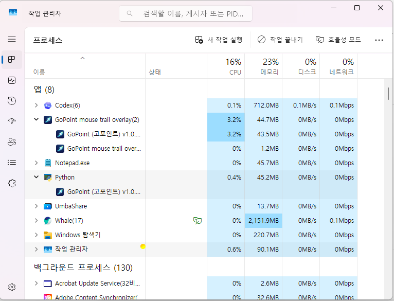

# 🖱️ GoPoint (고포인트)

[](https://github.com/ruruoni1/GoPoint/releases/latest)
[](https://opensource.org/licenses/MIT)

**GoPoint**는 튜토리얼 영상, 프레젠테이션, 또는 화면 공유 중에 시청자가 마우스 커서를 놓치지 않도록 직관적이고 아름다운 꼬리(Trail) 효과를 더해주는 윈도우용 유틸리티 프로그램입니다.

기존 마우스 효과 프로그램들의 뚝뚝 끊기는 현상을 완벽히 해결하고, **물리 스프링(Spring) 알고리즘**을 적용하여 엄청나게 부드럽고 자연스럽게 쫓아오는 마우스 트레일을 경험해 보세요! ✨

<br>

*개발자: [GoVerseTV (고버스TV)](https://www.youtube.com/@GOVERSE82)*

---

## 🆕 v1.0.16 업데이트

> **중요**
> `v1.0.12` 사용자는 자동 업데이트 판별 오류 때문에 **이번 한 번은 수동 설치가 필요합니다.**
> 최신 파일은 릴리즈 페이지의 **[GoPoint.exe](https://github.com/ruruoni1/GoPoint/releases/latest)** 를 직접 받아 설치해 주세요.

* 트레이에 이미 실행 중인 인스턴스가 있으면 새 창을 띄우지 않고 기존 설정창만 다시 열도록 중복 실행을 막았습니다.
* `update-test/update.json` 또는 `GOPOINT_UPDATE_MANIFEST`를 사용해 GitHub 없이도 로컬 자동 업데이트 테스트를 할 수 있습니다.
* `v1.0.13`에서 추가한 성능 최적화와 `1단계`, `2단계`, `3단계` 저사양 모드는 그대로 유지됩니다.
* 최신 배포 파일: **[GoPoint.exe](https://github.com/ruruoni1/GoPoint/releases/latest)**

### 작업 관리자 예시

오래된 PC 환경에서도 CPU 점유를 이전보다 낮춘 상태입니다. 아래 이미지는 실제 최신 빌드 실행 예시입니다.



<br>

## 🚀 주요 기능 (Features)

* **✨ 무결점 부드러운 곡선 (Smooth Tracking):** 스프링 물리 효과 알고리즘이 적용되어 아무리 마우스를 빠르게 움직여도 곡선이 꺾이지 않고 실크처럼 부드럽게 쫓아옵니다.
* **🔄 최신 버전 자동 업데이트 (Auto-Updater):** 프로그램 실행 시 또는 버튼 클릭 한 번으로 Github의 최신 버전을 감지하고 자동으로 앱을 갱신합니다.
* **🎨 다양한 스타일 & 컬러 파레트:**
  * **실선 (Constant):** 처음부터 끝까지 일정한 두께의 선형 효과
  * **점 (Dots):** 귀여운 점들이 쫓아오는 효과
  * **혜성 (Tapered):** 꼬리로 갈수록 얇아지는 세련된 유성 효과
* **⚙️ 완벽한 커스터마이징:** 두께, 꼬리 길이, 투명도 페이드 아웃 효과, 그리고 나만의 다중 색상(그라데이션)을 마음대로 설정하고 프로파일로 저장할 수 있습니다.
* **🌍 멀티 언어 지원:** 한국어는 물론 영어, 일본어, 중국어, 스페인어, 프랑스어, 독일어, 러시아어를 네이티브로 지원합니다.
* **⚡ 가벼운 시스템 리소스:** 시스템 백그라운드(시스템 트레이)에서 조용하고 가볍게 동작하며, 게임이나 다른 작업에 방해가 되지 않습니다 (TopMost Z-Order 완벽 지원).

<br>

## 📥 다운로드 및 실행 방법 (Download & Usage)

파이썬이나 복잡한 환경 설정 없이, **클릭 한 번으로 실행되는 단일 파일**로 제공됩니다.

1. 우측 메뉴 또는 아래 링크를 통해 **[최신 릴리스(Releases)](https://github.com/ruruoni1/GoPoint/releases/latest)** 페이지로 이동합니다.
2. `GoPoint.exe` (가장 최신 버전) 파일을 다운로드합니다.
3. 다운로드 받은 파일을 **더블 클릭하여 실행**합니다! 
4. 작업 표시줄 우측 (시계 옆) **시스템 트레이 숨겨진 아이콘**에 하늘색 동그라미 아이콘이 생기면 성공적으로 실행된 것입니다. 아이콘을 마우스 왼쪽 버튼으로 클릭하여 설정창을 열어 꾸며보세요.

<br>

## 🛠️ 개발 환경 및 빌드 방법 (For Developers)

직접 소스 코드를 수정하고 빌드하고 싶으신 분들을 위한 가이드입니다.

### 요구 사항
* Python 3.9 이상
* Windows OS 환경

### 의존성(Dependencies) 설치
```bash
pip install -r requirements.txt
# 또는
pip install PyQt6 pywin32
```

### 소스코드 직접 실행
```bash
python GoPoint.py
```

### 단일 실행 파일(.exe) 빌드
[Nuitka](https://nuitka.net/)를 사용하여 C++ 기반 단일 EXE를 빌드합니다.
```bash
pip install nuitka zstandard ordered-set
build_nuitka.bat
```

<br>

## 💬 문의 및 피드백 (Contact)

* 📺 **YouTube:** [고버스TV 놀러가기](https://www.youtube.com/@GOVERSE82)
* 💌 **Email:** ruruoni1@gmail.com
* 💛 **KakaoTalk:** [오픈채팅방 질문하기](https://open.kakao.com/o/gN0Fx9Df)

---
*GoPoint 가 화면 속 여러분의 중요한 순간이 더 빛나도록 도와드릴게요! 💪*
